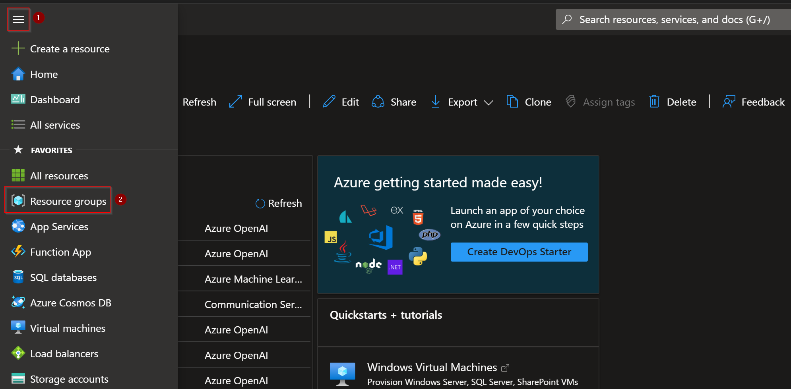
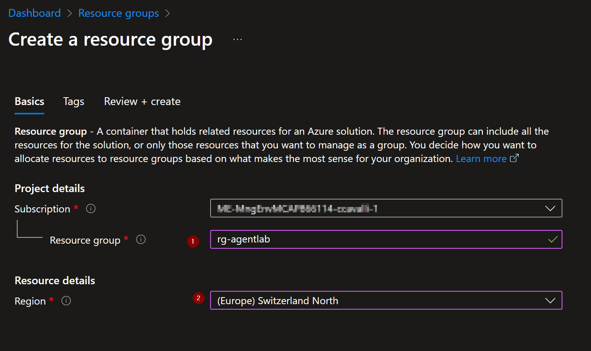
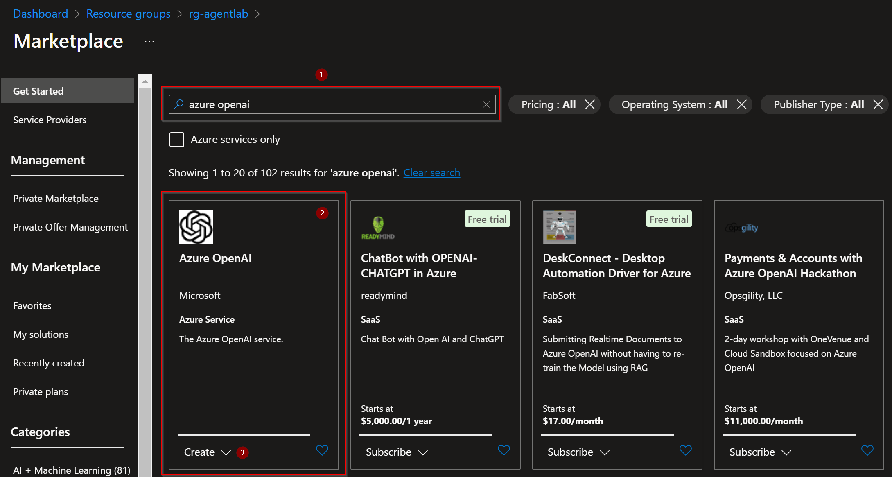
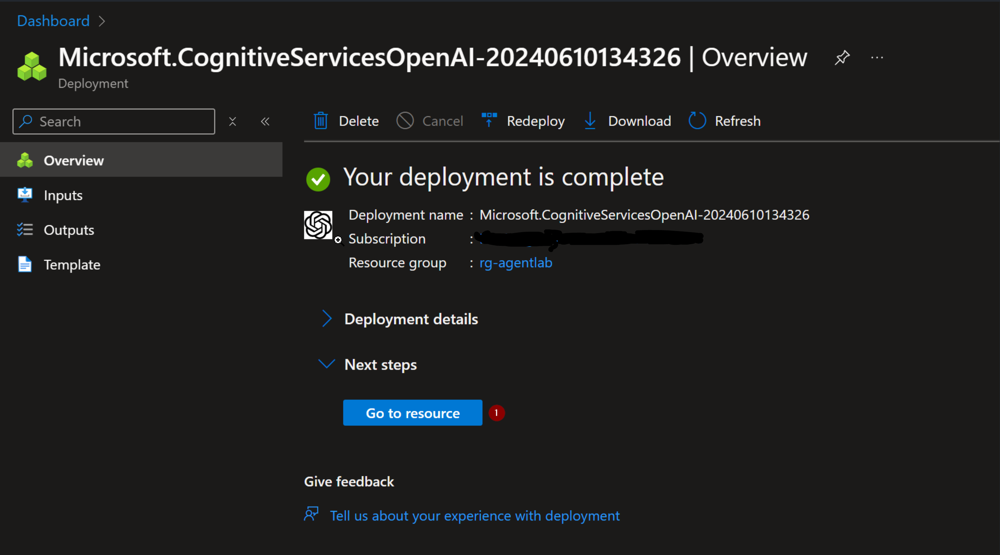
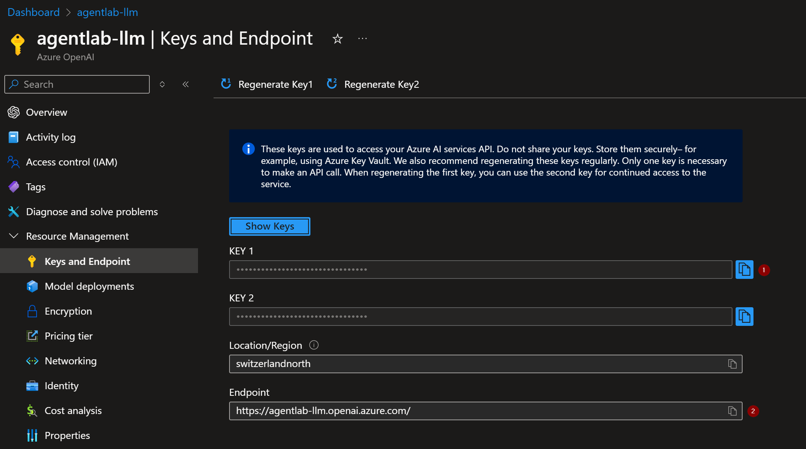
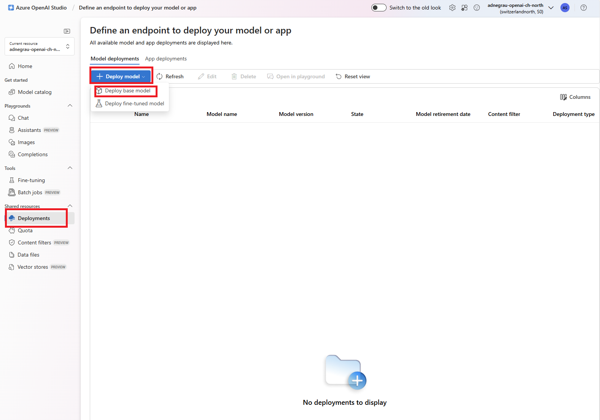
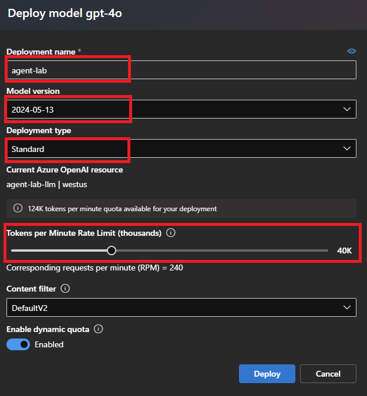

# Create Azure OpenAI resource using the Azure Portal

1. Navigate to the [Azure portal](https://portal.azure.com) and login using your credentials.  

2. Click the menu icon on the top-left (1)

3. Select `Resource groups` (2)  

      

4. Select `Create`  

      

5. Enter a valid name for your resource group (e.g. *rg-agentlab*) and select *West US*  

    **Note:** The model availability changes from region to region so, while not strictly mandatory, it is always better to choose a resource group in the same region as the service you will deploy. See the [availability map](https://learn.microsoft.com/en-us/azure/ai-services/openai/concepts/models#standard-deployment-model-availability).  

      

6. Click the `review and create`button at the botton of the page and the click the `create` button once the validation passes.
7. Once the resource group is created, select it from the list of existing resource groups.
8. In the page dedicated to your new resource group, click the `create` button.  

    

9. In the **Marketplace** page, in the search box (1) type `azure openai` and select the first result on the list and click `create` `Azure OpenAI`(3).  

      

10. In the **Create Azure OpenAI** as resource group select the one you have just created (1), select the same region you have chosen for the resource group (2), give a name to the resource (3) (e.g. *agentlab-llm*)and select `Standard S0` as pricing tier (4).
    Once done, click the `Next` button at the bottom of the page.  

      

11. Click next until you reach the `Review + submit` step, then click the `Create` button at the bottom of the page.  

12. Once the operation has completed, click the `Go to resource` button.

     

13. In the just created OpenAI resource, click the  **Endpoint** link (1)

      

14. In the **Keys and Enpoint** page copy the value of both **Key 1** (1) and **Endpoint** (2) ❗ because you will need them later.

     

15. Navigate back to the previous page and click the `Go to Azure OpenAI Studio`(2) button.
16. In the Azure OpenAI studio portal click the `Deployments` menu on the left, select `Deploy model` and then `Deploy base model`.  

     
17. On the `Select a model`, choose gpt-4o.

18. On the **Deploy model gpt-4o** form use the following values. 
    1. `Select a model` = `gpt-4o`
    2. `Deployment name` = Choose any compatible name and **make a note of it**❗(e.g. *agent-lab*) since you will need this info later.
    3. Set the `Tokens per Minute Rate Limit` to the maximum value of `40K`

    

19. Click the `Create` button and wait the deployment to complete.
20. You're done! Now return to configure the lab.

