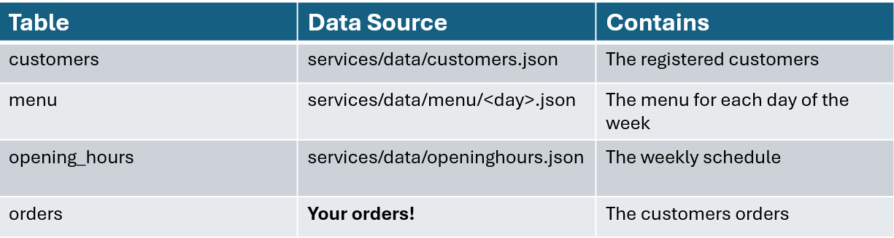

# Understanding the use case

## What is the goal of this lab?

Using a simple step-by-step approach we will create a solution which can use natural language to:  

  - Provide information regarding opening hours and available menus.
  - Place an order.
  - Ask for your pending orders.
  - Cancel a pending order.

### About the data involved

All the data you are gonna see (and generate) will be saved in a local SQL-Lite database represented by the `services/data/agent-lab.db` file.  
The repo contains a ready to use database so you don't have to do anything on this side.

For those interested, here are the tables it contains:

    

Feel free to have a look at the files used as sample-data if you want to know more about the contents of the database. 

Is important to know that, when you want to *place*, *see* or *cancel* an order you would need to identify yourself as one of the three users actually present in the database that are:  

- **Bart Simpson** Id: `1234` Card Digits: `8743`
- **Homer Simpson** Id: `5678` Card Digits: `6295`
- **Margie Simpson** Id: `9101` Card Digits: `4801`

If you prefer instead to register yourself, use the option below.

### The Utility Notebook

This [notebook](../notebooks/99-db_utility.ipynb) contains utility cells that you can run **individually** in case you want to:  

1. Reset the database and reload the data from the json files.
2. Add new customers.
3. Change the status of an order.

