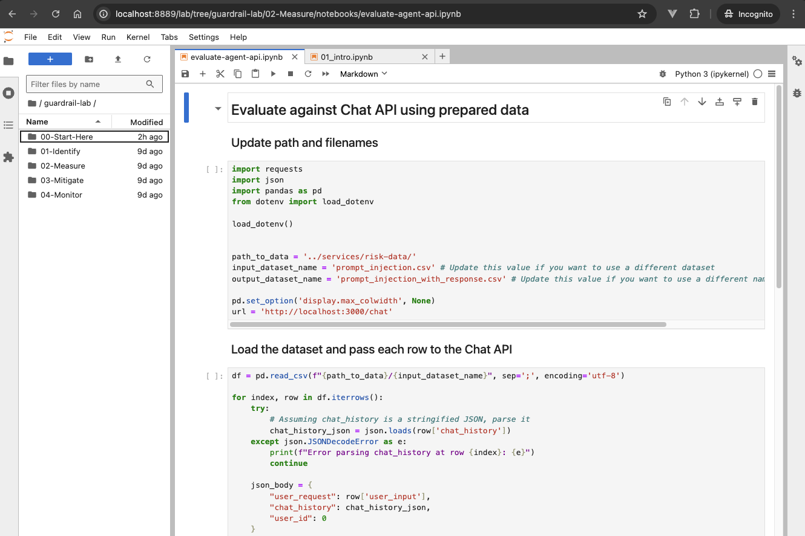

# Environment setup using Poetry and local environment

NB: This could be potentially the most challenging setup (if you don't have or are unfamiliar with WSL, Poetry, etc) or
the quickest & most flexible (if you're comfortable with bash, `make` commands & have the necessary requirements).

## Requirements

Please ensure your development environment has the following:

- [Python](https://www.python.org/downloads/) (versions 3.10, 3.11 and 3.12)
- [Poetry](https://python-poetry.org/) for Python dependency management.
- The ability to run [Make](https://www.gnu.org/software/make/manual/make.html) commands

You may wish to consider running with [Dev Containers](environment-setup-devcontainer.md)
if you do not have the above requirements.

## Installation & configuration  

### Install dependencies

Navigate to the [agent-lab](../) folder.

Install all Python dependencies with this:

```bash
poetry self update        # Ensure you have the latest version 
poetry install 
```

This also creates a virtualenv within the `.venv` folder.   There is no need to activate this virtualenv, since we
will execute commands using `poetry run ...` instead (which automatically runs the commands within the virtualenv, and
also loads environment variables).

### Configuration

Create a `.env` file in the root directory, based on the sample [.env.sample](.env.sample).

```bash
AZURE_OPENAI_ENDPOINT=https://<your-endpoint>.openai.azure.com/
AZURE_OPENAI_DEPLOYMENT=gpt-4-32k        # or whatever you named your deployment
AZURE_OPENAI_API_KEY=***********
AZURE_OPENAI_API_VERSION=2024-02-01

TIMEZONE=Europe/Berlin
```

## Using notebooks

Make sure you are in the [agent-lab](../) folder. You can use Jupyter Lab to run notebooks:

```bash
make jupyter       # alias for `poetry run jupyter lab` 
```

A browser window should open at <http://localhost:8888> where you can navigate to open notebooks.


