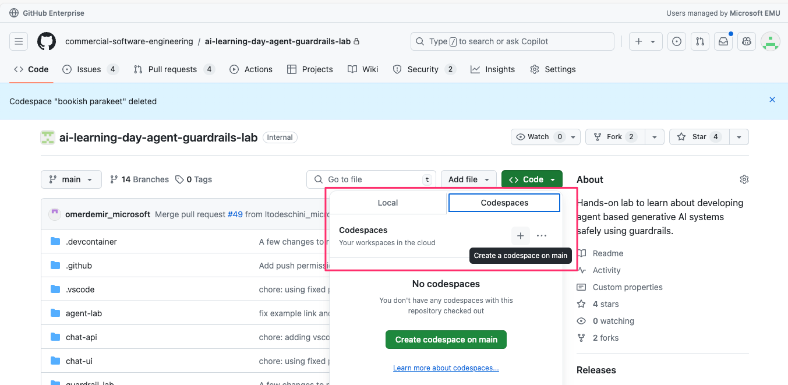
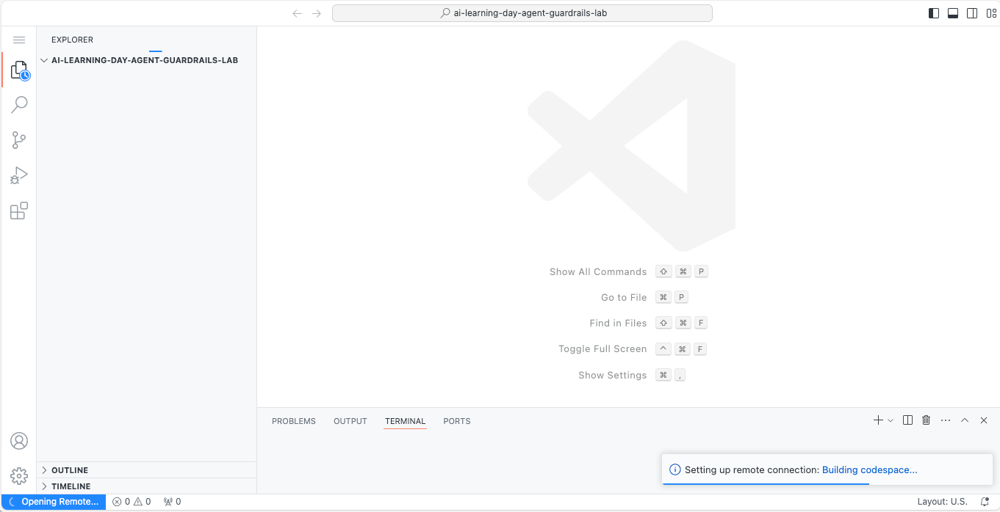
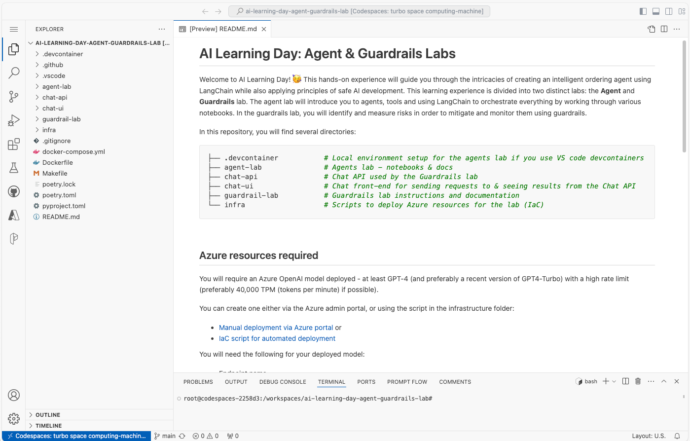
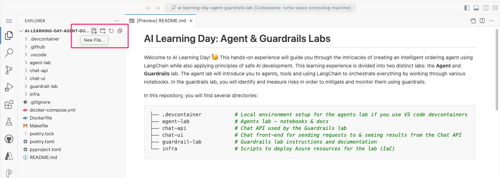

# Running in Github Codespaces 

A Github Codespace is a development environment that's hosted in the cloud.
This is the ideal choice if you face challenges with (or would rather not) configure 
your local development machine with the required dependencies. 

## Step by step instructions 

### 1. Create your Codespace 

Go to the repository and select `Code -> Codespaces (tab)` and click the `+` icon:



<br>

### 2. Wait for the Codespace to be created 

It may take ~10 minutes for the Codespace environment to be created, during which time you will see something like this:



Once the Codespace is ready, you will see a UI which looks somewhat like VS Code with the file explorer on the left, editor pane in the center with a series of tabs below (including one for terminals). 



<br>

### 3. Add a `.env` file

Add a `.env` file in the root directory:



You can use the `.env.sample` included in the repo as a basis for your `.env` file.

```bash 
AZURE_OPENAI_ENDPOINT=https://**********.openai.azure.com/
AZURE_OPENAI_DEPLOYMENT=gpt-4-32k
AZURE_OPENAI_API_KEY=**********
AZURE_OPENAI_API_VERSION= 2024-02-01

TIMEZONE=Europe/Berlin

VITE_CHAT_API="http://127.0.0.1:3000"
```

<br>

### 4. Build the required docker images 

Open a Terminal in the bottom pane & use the following `make` commands to create the docker images: 

```bash 
make backend-build  # for the backend (restaurant) APIs 
make chat-build     # for Chat API to interact with the agent/LLM
make ui-build       # for serving front-end Chat UI 
```

<br>


### 5. Run the backend API, chat API & UI 

Using docker-compose within the Codespace terminal: 

```bash 
docker-compose up 
```